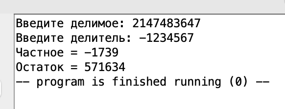

```assembly
.data
    arg01:  .asciz "Введите делимое: "
    arg02:  .asciz "Введите делитель: "
    result01: .asciz "Частное = "
    result02: .asciz "Остаток = "
    resultError: .asciz "Ошибка при делении на 0"
    ln:     .asciz "\n"
.text
    la   a0 arg01
    li   a7 4
    ecall
    li   a7 5
    ecall
    mv   t0 a0
    la   a0 arg02
    li   a7 4
    ecall
    li   a7 5
    ecall
    mv   t1 a0
    li   t2 1
    li   t3 1
if_t1_1:
    li   t6 1
    bne  t1 t6 if_t1_0
    mv   t4 t0
    mv   t0 zero
    j    result
if_t1_0:
    bnez t1 if_t0_0
    j    error
if_t0_0:
    bnez t0 if_t0_less_0
    j    zero_
if_t0_less_0:
    bgtz t0 if_t1_less_0
    li   t2 -1
    sub  t0 zero t0
    j    if_t1_less_0
if_t1_less_0:
    bgtz t1 else
    li   t3 -1
    sub  t1 zero t1
    j    else
else:
    mv   t4 zero
    j   while
while:
    bgt  t1 t0 end_while
    sub  t0 t0 t1
    addi t4 t4 1
    j    while
end_while:
    bgtz t2 if_t3_less_0
    sub  t0 zero t0
    sub  t4 zero t4
    j if_t3_less_0
if_t3_less_0:
    bgtz t3 result
    sub  t4 zero t4
    j   result 
result:
    la   a0 result01
    li   a7 4
    ecall
    mv   a0 t4
    li   a7 1
    ecall
    la   a0 ln
    li   a7 4
    ecall
    la   a0 result02
    li   a7 4
    ecall
    mv   a0 t0
    li   a7 1
    ecall
    li   a7 10
    ecall
zero_:
    la   a0 result01
    li   a7 4
    ecall
    mv   a0 zero
    li   a7 1
    ecall
    la   a0 ln
    li   a7 4
    ecall
    la   a0 result02
    li   a7 4
    ecall
    mv   a0 zero
    li   a7 1
    ecall
    li   a7 10
    ecall
error:
    li   a7 4
    la   a0 resultError
    ecall
    li     a7 10
    ecall
```

Возможные случаи работы программы:
* Когда делимое и делитель положительные


* Когда делимое положительно, а  делитель отрицательный



* Когда делимое отрицательно, а  делитель положительный


* Когда делимое и делитель отрицательные


* При делении на ноль


* Делимое меньше делителя


* При делении на единицу


* При делении на самого себя


* При делении нуля на что-либо


